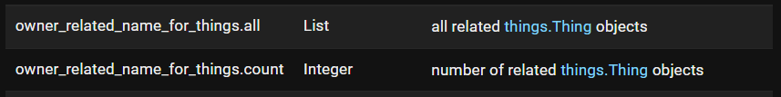
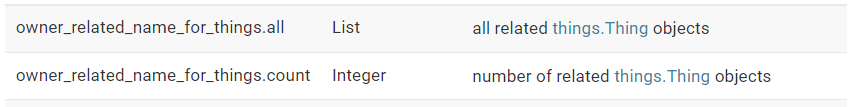
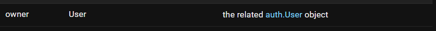
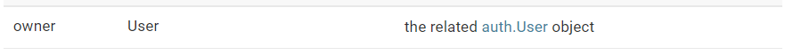

# `related_name` - **UNDER CONSTRUCTION**

## Related Code Snippets

* [`things/models.py`](./things/models.py):

  ```python
  class Thing(models.Model):
      #...
      owner = models.ForeignKey(
          #...
          related_name='owner_related_name_for_things',
          #...
      )
          #...
  ```

* [`api/serializers.py`](./api/serializers.py):

  ```python
  class UserSerializerWithThings(serializers.ModelSerializer):
      things = NestedThingSerializer(
          #...
          source='owner_related_name_for_things',
          #...
      )
        
          class Meta:
              #...
              fields = (
                  #...
                  'things',
                  #...
              )
  ```

* [`templates/home.html`](./templates/home.html):

  ```html
  <!--  -->
  <p>{{ user.owner_related_name_for_things.all }}</p>
  <!--  -->
  ```

## Related Django Admin Images

* Model: `auth.User`:
  * 
  * 
  * 
  * 
* Model: `things.Thing`:
  * 
  * 
  * 
  * 

## Resources

* [`CASCADE` - docs.djangoproject.com](https://docs.djangoproject.com/en/4.0/ref/models/fields/#django.db.models.CASCADE)
* [`django.views.generic.list.ListView` - docs.djangoproject.com](https://docs.djangoproject.com/en/4.1/ref/class-based-views/generic-display/#django.views.generic.list.ListView)
* [How to manage static files (e.g. images, JavaScript, CSS) - docs.djangoproject.com](https://docs.djangoproject.com/en/4.1/howto/static-files/#how-to-manage-static-files-e-g-images-javascript-css)

## Lessons Learned

* File load order is related to order of HTTP requests:

  ```console
  [11/Dec/2022 03:10:13] "GET /things/ HTTP/1.1" 200 1250
  [11/Dec/2022 03:10:13] "GET /static/images/auth_user_theme_light.png HTTP/1.1" 200 15208
  [11/Dec/2022 03:10:13] "GET /static/images/auth_user_theme_dark.png HTTP/1.1" 200 14895
  [11/Dec/2022 03:10:13] "GET /static/images/things_thing_theme_dark.png HTTP/1.1" 200 5329
  [11/Dec/2022 03:10:13] "GET /static/images/things_thing_theme_light.png HTTP/1.1" 200 5104
  ```

## TODO

## Notes

## Directory Structure

## Tags

* cascade
* django
* related_name
* static
* staticfiles
* STATICFILES_DIRS
* ListView
