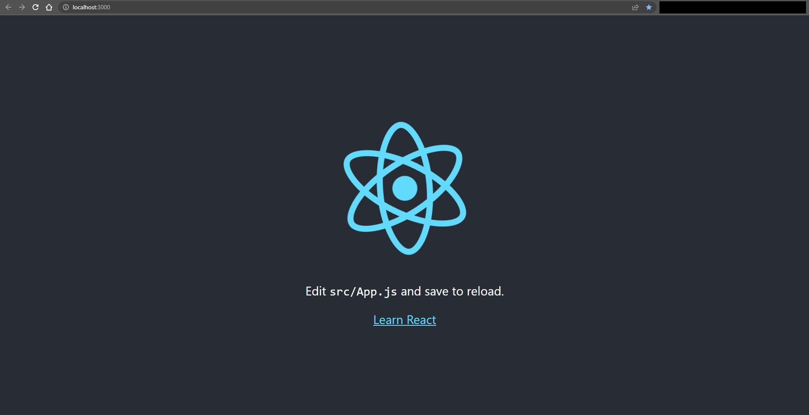
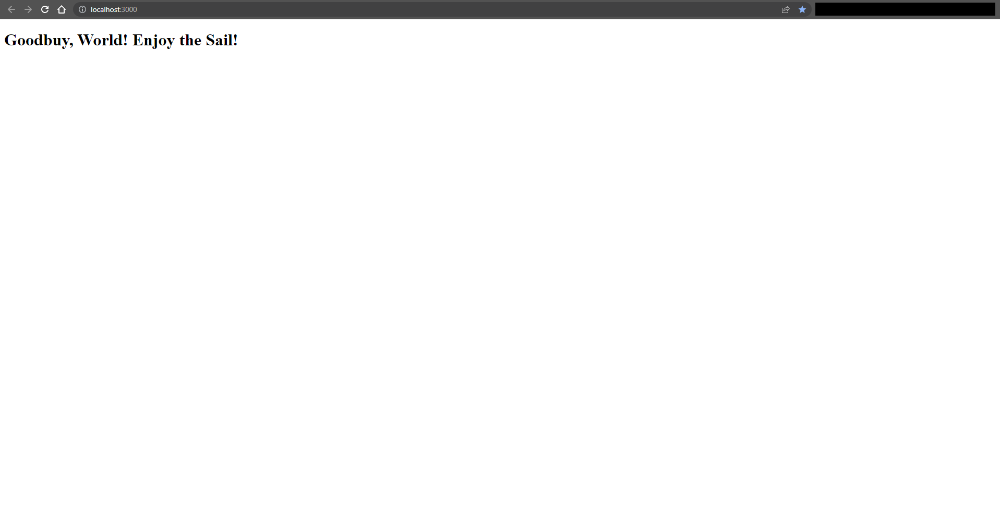
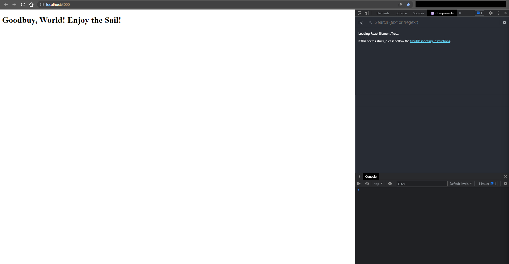

# Goodbuy, World

## Resources

* <https://reactjs.org/docs/hello-world.html>
* [Hello World](https://codepen.io/gaearon/pen/MjrdWg?editors=1010)
* [Hello World](https://codepen.io/gaearon/pen/MjrdWg)

## Process

1. Start in root of project:
    * `Get-Location`:

        ```console
        PS C:\Users\FlynntKnapp\Programming\examples\react\00-goodbuy-world> Get-Location      

        Path
        ----
        C:\Users\FlynntKnapp\Programming\examples\react\00-goodbuy-world

        PS C:\Users\FlynntKnapp\Programming\examples\react\00-goodbuy-world>
        ```

1. List current directory contents:
    * `Get-Childitem`:

        ```console
        PS C:\Users\FlynntKnapp\Programming\examples\react\00-goodbuy-world> Get-Childitem     

            Directory: C:\Users\FlynntKnapp\Programming\examples\react\00-goodbuy-world

        Mode                 LastWriteTime         Length Name
        ----                 -------------         ------ ----
        -a---          12/26/2022  2:58 AM            468 README.md

        PS C:\Users\FlynntKnapp\Programming\examples\react\00-goodbuy-world>
        ```

1. Make directory for 'images':
    * `New-Item -ItemType 'directory' -Name images`:

        ```console
        PS C:\Users\FlynntKnapp\Programming\examples\react\00-goodbuy-world> New-Item -ItemType 'directory' -Name images        

            Directory: C:\Users\FlynntKnapp\Programming\examples\react\00-goodbuy-world

        Mode                 LastWriteTime         Length Name
        ----                 -------------         ------ ----
        d----          12/26/2022  3:04 AM                images

        PS C:\Users\FlynntKnapp\Programming\examples\react\00-goodbuy-world>
        ```

1. List current directory contents:
    * `Get-Childitem`:

        ```console
        PS C:\Users\FlynntKnapp\Programming\examples\react\00-goodbuy-world> Get-Childitem     

            Directory: C:\Users\FlynntKnapp\Programming\examples\react\00-goodbuy-world

        Mode                 LastWriteTime         Length Name
        ----                 -------------         ------ ----
        d----          12/26/2022  3:04 AM                images
        -a---          12/26/2022  2:58 AM            468 README.md

        PS C:\Users\FlynntKnapp\Programming\examples\react\00-goodbuy-world>
        ```

1. Create new React app:
    * `npx create-react-app my-app`:

        ```console
        PS C:\Users\FlynntKnapp\Programming\examples\react\00-goodbuy-world> npx create-react-app my-app
        Need to install the following packages:
          create-react-app@5.0.1
        Ok to proceed? (y) y
        npm WARN deprecated tar@2.2.2: This version of tar is no longer supported, and will not receive security updates. Please upgrade asap.

        Creating a new React app in C:\Users\FlynntKnapp\Programming\examples\react\00-goodbuy-world\my-app.

        Installing packages. This might take a couple of minutes.
        Installing react, react-dom, and react-scripts with cra-template...


        added 1397 packages in 31s

        214 packages are looking for funding
          run `npm fund` for details

        Installing template dependencies using npm...

        added 71 packages in 4s

        226 packages are looking for funding
          run `npm fund` for details
        Removing template package using npm...


        removed 1 package, and audited 1468 packages in 2s

        226 packages are looking for funding
          run `npm fund` for details

        6 high severity vulnerabilities

        To address all issues (including breaking changes), run:
          npm audit fix --force

        Run `npm audit` for details.

        Success! Created my-app at C:\Users\FlynntKnapp\Programming\examples\react\00-goodbuy-world\my-app
        Inside that directory, you can run several commands:

          npm start
            Starts the development server.

          npm run build
            Bundles the app into static files for production.

          npm test
            Starts the test runner.

          npm run eject
            Removes this tool and copies build dependencies, configuration files
            and scripts into the app directory. If you do this, you can’t go back!

        We suggest that you begin by typing:

          cd my-app
          npm start

        Happy hacking!
        PS C:\Users\FlynntKnapp\Programming\examples\react\00-goodbuy-world>
        ```

1. Change directory to 'my-app':
    * `Set-Location -Path .\my-app\`:

        ```console
        PS C:\Users\FlynntKnapp\Programming\examples\react\00-goodbuy-world> Set-Location -Path .\my-app\
        PS C:\Users\FlynntKnapp\Programming\examples\react\00-goodbuy-world\my-app>
        ```

1. Test development server:
    * `npm start`:

        ```console
        PS C:\Users\FlynntKnapp\Programming\examples\react\00-goodbuy-world\my-app> npm start

        > my-app@0.1.0 start
        > react-scripts start

        (node:6780) [DEP_WEBPACK_DEV_SERVER_ON_AFTER_SETUP_MIDDLEWARE] DeprecationWarning: 'onAfterSetupMiddleware' option is deprecated. Please use the 'setupMiddlewares' option.
        (Use `node --trace-deprecation ...` to show where the warning was created)
        (node:6780) [DEP_WEBPACK_DEV_SERVER_ON_BEFORE_SETUP_MIDDLEWARE] DeprecationWarning: 'onBeforeSetupMiddleware' option is deprecated. Please use the 'setupMiddlewares' option.
        Starting the development server...
        Compiled successfully!

        You can now view my-app in the browser.

          Local:            http://localhost:3000
          On Your Network:  http://192.168.0.8:3000

        Note that the development build is not optimized.
        To create a production build, use npm run build.

        webpack compiled successfully
        ```

1. Examine browser:
    * <http://localhost:3000>:

        

1. Remove everything from [`my-app/src/`](./my-app/src/) except the following:
    * [`my-app/src/index.js`](./my-app/src/index.js)

1. Edit [`my-app/src/index.js`](./my-app/src/index.js) to contain the following:

    ```javascript
    import ReactDOM from 'react-dom/client';

    const root = ReactDOM.createRoot(document.getElementById('root'));
    root.render(
    <h1>Goodbuy, World! Enjoy the Sail!</h1>
    );
    ```

1. Remove everything from [`my-app/public/`](./my-app/public/) except the following:
    * [`my-app/public/index.html`](./my-app/public/index.html)

1. Edit [`my-app/public/index.html`](./my-app/public/index.html) to contain the following:

    ```html
    <!DOCTYPE html>
    <html lang="en">

    <head>
        <meta charset="utf-8" />
        <meta name="viewport" content="width=device-width, initial-scale=1" />
        <title>Goodbuy, World!</title>
    </head>

    <body>
        <noscript>You need to enable JavaScript to run this app.</noscript>
        <div id="root"></div>
    </body>

    </html>
    ```

1. Leave [`my-app/package-lock.json`](./my-app/package-lock.json) and [`my-app/package.json`](./my-app/package.json) in their current state. I'm not yet sure what they do.

1. Also, leave [`my-app/node_modules/`](./my-app/node_modules/) in its current state. I'm not yet sure what it does.

1. Examine browser:
    * <http://localhost:3000>:

        

1. Note that React dev tools doesn't show any components:
    * This is due to the fact that we're not using React components. We're using the React DOM API directly.

        
