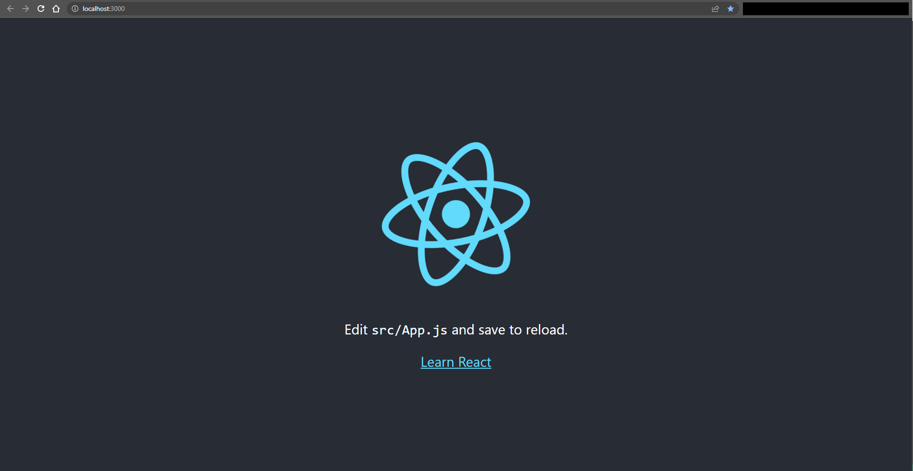
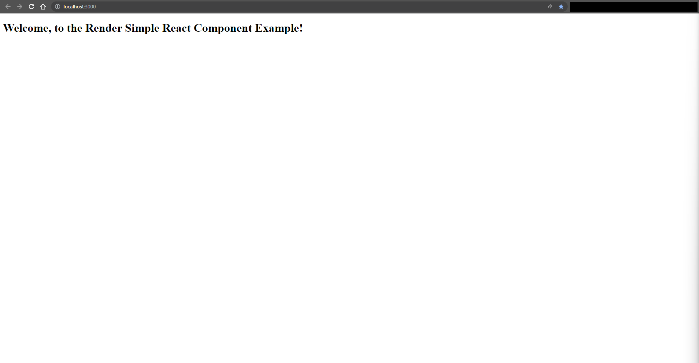

# Process

1. Start in project root directory.
    * `Get-Location`:
        * Sample console output:

            ```console
            PS C:\Users\FlynntKnapp\Programming\examples\react\00-render-simple-react-component> Get-Location

            Path
            ----
            C:\Users\FlynntKnapp\Programming\examples\react\00-render-simple-react-component

            PS C:\Users\FlynntKnapp\Programming\examples\react\00-render-simple-react-component>
            ```

1. Inspect current directory contents:
    * The author has a `README.md` file and a `notes` directory:
    * `Get-ChildItem`:
        * Sample console output:

            ```console
            PS C:\Users\FlynntKnapp\Programming\examples\react\00-render-simple-react-component> Get-ChildItem

                Directory:
            C:\Users\FlynntKnapp\Programming\examples\react\00-render-simple-react-component

            Mode                 LastWriteTime         Length Name
            ----                 -------------         ------ ----
            d----            1/1/2023  4:41 PM                notes
            -a---            1/1/2023  4:49 PM           1057 README.md

            PS C:\Users\FlynntKnapp\Programming\examples\react\00-render-simple-react-component>
            ```

    * [`README.md`](../README.md) has project information.
    * [`notes/process.md`](../notes/process.md), this document, has code changes throughout this example.

1. Use `create-react-app` to create a new React app:
    * `npx create-react-app my-react-app`:
    * Sample console output:

        ```console
        PS C:\Users\FlynntKnapp\Programming\examples\react\00-render-simple-react-component> npx create-react-app my-react-app

        Creating a new React app in C:\Users\FlynntKnapp\Programming\examples\react\00-render-simple-react-component\my-react-app.

        Installing packages. This might take a couple of minutes.
        Installing react, react-dom, and react-scripts with cra-template...


        added 1397 packages in 38s

        214 packages are looking for funding
          run `npm fund` for details

        Installing template dependencies using npm...

        added 71 packages in 14s

        226 packages are looking for funding
          run `npm fund` for details
        Removing template package using npm...


        removed 1 package, and audited 1468 packages in 2s

        226 packages are looking for funding
          run `npm fund` for details

        10 high severity vulnerabilities

        To address all issues (including breaking changes), run:
          npm audit fix --force

        Run `npm audit` for details.

        Success! Created my-react-app at C:\Users\FlynntKnapp\Programming\examples\react\00-render-simple-react-component\my-react-app
        Inside that directory, you can run several commands:

          npm start
            Starts the development server.

          npm run build
            Bundles the app into static files for production.

          npm test
            Starts the test runner.

          npm run eject
            Removes this tool and copies build dependencies, configuration files
            and scripts into the app directory. If you do this, you can’t go back!

        We suggest that you begin by typing:

          cd my-react-app
          npm start

        Happy hacking!
        PS C:\Users\FlynntKnapp\Programming\examples\react\00-render-simple-react-component>
        ```

1. Change directory to the new React app root:
    * `Set-Location my-react-app`:
    * Sample console output:

        ```console
        PS C:\Users\FlynntKnapp\Programming\examples\react\00-render-simple-react-component> Set-Location my-react-app
        PS C:\Users\FlynntKnapp\Programming\examples\react\00-render-simple-react-component\my-react-app>
        ```

1. Start server to test the React app:
    * `npm start`:
    * Sample console output:

        ```console
        PS C:\Users\FlynntKnapp\Programming\examples\react\00-render-simple-react-component\my-react-app> npm start

        > my-react-app@0.1.0 start
        > react-scripts start

        (node:19452) [DEP_WEBPACK_DEV_SERVER_ON_AFTER_SETUP_MIDDLEWARE] DeprecationWarning: 'onAfterSetupMiddleware' option is deprecated. Please use the 'setupMiddlewares' option.
        (Use `node --trace-deprecation ...` to show where the warning was created)
        (node:19452) [DEP_WEBPACK_DEV_SERVER_ON_BEFORE_SETUP_MIDDLEWARE] DeprecationWarning: 'onBeforeSetupMiddleware' option is deprecated. Please use the 'setupMiddlewares' option.
        Starting the development server...
        Compiled successfully!

        You can now view my-react-app in the browser.

          Local:            http://localhost:3000
          On Your Network:  http://192.168.0.8:3000

        Note that the development build is not optimized.
        To create a production build, use npm run build.

        webpack compiled successfully
        ```

1. Examine browser display:

    

1. Stop the development server:
    1. Press `Ctrl+C` in the console window.
        * Sample console output:

            ```console
            Terminate batch job (Y/N)?
            ```

    1. Enter `y` to confirm stopping the server ('Terminate batch job').
        * Sample console output:

            ```console
            Terminate batch job (Y/N)? y
            PS C:\Users\FlynntKnapp\Programming\examples\react\00-render-simple-react-component\my-react-app>
            ```

1. Remove all files from [`public/`](../my-react-app/public/) directory except the following:
    * `index.html`

1. Remove all files from [`src/`](../my-react-app/src/) directory except the following:
    * `index.js`

1. Replace existing contents of [`index.html`](../my-react-app/public/index.html) with the following:

    ```html
    <!DOCTYPE html>
    <html lang="en">

    <head>
        <meta charset="utf-8" />
        <meta name="viewport" content="width=device-width, initial-scale=1" />
        <title>Render React Component</title>
    </head>

    <body>
        <noscript>You need to enable JavaScript to run this app.</noscript>
        <div id="root"></div>
    </body>

    </html>
    ```

1. Replace existing contents of [`index.js`](../my-react-app/src/index.js) with the following:

    ```javascript
    import React from 'react';
    import ReactDOM from 'react-dom/client';

    class ExampleComponent extends React.Component {
        render() {
            return <h1>Welcome, to the Render Simple React Component Example!</h1>;
        }
    }

    const root = ReactDOM.createRoot(document.getElementById('root'));
    root.render(
        <React.StrictMode>
            <ExampleComponent />
        </React.StrictMode>
    );
    ```

1. Start server to test the React app:
    * `npm start`:
        * Sample console output:

            ```console
            PS C:\Users\FlynntKnapp\Programming\examples\react\00-render-simple-react-component\my-react-app> npm start

            > my-react-app@0.1.0 start
            > react-scripts start

            (node:24388) [DEP_WEBPACK_DEV_SERVER_ON_AFTER_SETUP_MIDDLEWARE] DeprecationWarning: 'onAfterSetupMiddleware' option is deprecated. Please use the 'setupMiddlewares' option.
            (Use `node --trace-deprecation ...` to show where the warning was created)
            (node:24388) [DEP_WEBPACK_DEV_SERVER_ON_BEFORE_SETUP_MIDDLEWARE] DeprecationWarning: 'onBeforeSetupMiddleware' option is deprecated. Please use the 'setupMiddlewares' option.
            Starting the development server...
            Compiled successfully!

            You can now view my-react-app in the browser.

              Local:            http://localhost:3000
              On Your Network:  http://192.168.0.8:3000

            Note that the development build is not optimized.
            To create a production build, use npm run build.

            webpack compiled successfully
            ```

1. Examine browser display:

    

1. Stop the development server:
    1. Press `Ctrl+C` in the console window.
        * Sample console output:

            ```console
            Terminate batch job (Y/N)?
            ```

    1. Enter `y` to confirm stopping the server ('Terminate batch job').
        * Sample console output:

            ```console
            Terminate batch job (Y/N)? y
            PS C:\Users\FlynntKnapp\Programming\examples\react\00-render-simple-react-component\my-react-app>
            ```

## Links

* [README.md](../README.md) for this example.
