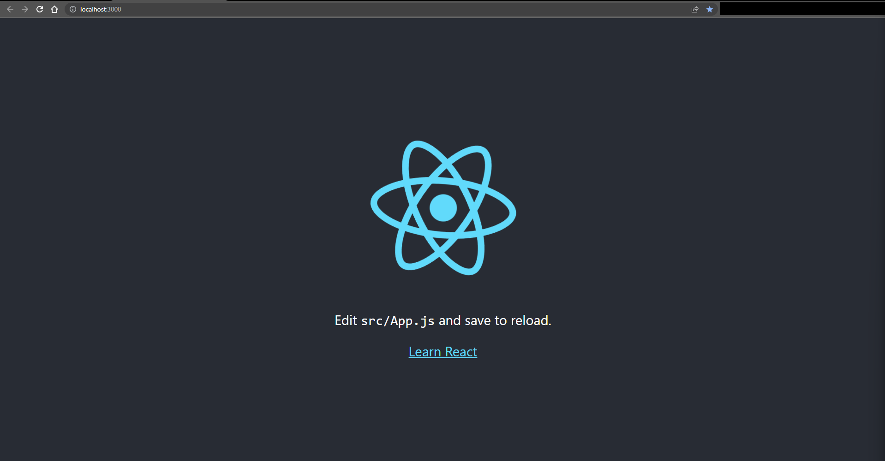
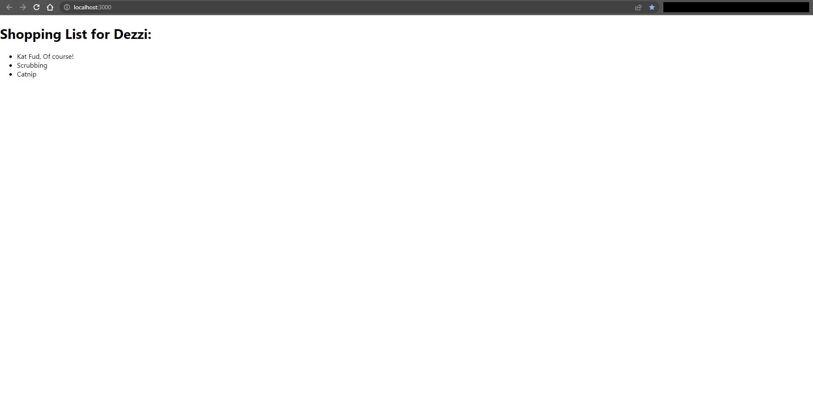

# Shopping List

1. Create Skeleton React App:
    * `npx create-react-app my-app`

        ```console
        PS C:\Users\FlynntKnapp\Programming\examples\react\shopping-list> npx create-react-app my-app

        Creating a new React app in C:\Users\FlynntKnapp\Programming\examples\react\shopping-list\my-app.

        Installing packages. This might take a couple of minutes.
        Installing react, react-dom, and react-scripts with cra-template...


        added 1397 packages in 32s

        214 packages are looking for funding
          run `npm fund` for details

        Installing template dependencies using npm...

        added 71 packages in 4s

        226 packages are looking for funding
          run `npm fund` for details
        Removing template package using npm...


        removed 1 package, and audited 1468 packages in 2s

        226 packages are looking for funding
          run `npm fund` for details

        6 high severity vulnerabilities

        To address all issues (including breaking changes), run:
          npm audit fix --force

        Run `npm audit` for details.

        Success! Created my-app at C:\Users\FlynntKnapp\Programming\examples\react\shopping-list\my-app
        Inside that directory, you can run several commands:

          npm start
            Starts the development server.

          npm run build
            Bundles the app into static files for production.

          npm test
            Starts the test runner.

          npm run eject
            Removes this tool and copies build dependencies, configuration files
            and scripts into the app directory. If you do this, you can’t go back!

        We suggest that you begin by typing:

          cd my-app
          npm start

        Happy hacking!
        PS C:\Users\FlynntKnapp\Programming\examples\react\shopping-list>
        ```

1. Change directory to `my-app`:
    * `cd my-app`

        ```console
        PS C:\Users\FlynntKnapp\Programming\examples\react\shopping-list> cd .\my-app\
        PS C:\Users\FlynntKnapp\Programming\examples\react\shopping-list\my-app>
        ```

1. Start React App:
    * `npm start`

        ```console
        PS C:\Users\FlynntKnapp\Programming\examples\react\shopping-list\my-app> npm start

        > my-app@0.1.0 start
        > react-scripts start

        (node:15264) [DEP_WEBPACK_DEV_SERVER_ON_AFTER_SETUP_MIDDLEWARE] DeprecationWarning: 'onAfterSetupMiddleware' option is deprecated. Please use the 'setupMiddlewares' option.
        (Use `node --trace-deprecation ...` to show where the warning was created)
        (node:15264) [DEP_WEBPACK_DEV_SERVER_ON_BEFORE_SETUP_MIDDLEWARE] DeprecationWarning: 'onBeforeSetupMiddleware' option is deprecated. Please use the 'setupMiddlewares' option.
        Starting the development server...
        Compiled successfully!

        You can now view my-app in the browser.

          Local:            http://localhost:3000
          On Your Network:  http://192.168.0.8:3000

        Note that the development build is not optimized.
        To create a production build, use npm run build.

        webpack compiled successfully
        ```

1. Open browser to <http://localhost:3000>:
    * Sample browser image:
        

1. Edit [`my-app/public/index.html`](./my-app/public/index.html) to match the following:

    ```html
    <!DOCTYPE html>
    <html lang="en">
    <head>
        <meta charset="utf-8" />
        <meta name="viewport" content="width=device-width, initial-scale=1" />
        <meta
        name="description"
        content="Web site created using create-react-app"
        />
        <link rel="manifest" href="%PUBLIC_URL%/manifest.json" />
        <!--
        Notice the use of %PUBLIC_URL% in the tags above.
        It will be replaced with the URL of the `public` folder during the build.
        Only files inside the `public` folder can be referenced from the HTML.

        Unlike "/favicon.ico" or "favicon.ico", "%PUBLIC_URL%/favicon.ico" will
        work correctly both with client-side routing and a non-root public URL.
        Learn how to configure a non-root public URL by running `npm run build`.
        -->
        <title>Shopping List</title>
    </head>
    <body>
        <noscript>You need to enable JavaScript to run this app.</noscript>
        <div id="root"></div>
        <!--
        This HTML file is a template.
        If you open it directly in the browser, you will see an empty page.

        You can add webfonts, meta tags, or analytics to this file.
        The build step will place the bundled scripts into the <body> tag.

        To begin the development, run `npm start` or `yarn start`.
        To create a production bundle, use `npm run build` or `yarn build`.
        -->
    </body>
    </html>

    ```

    * NOTES:
        * `<link rel="manifest" href="%PUBLIC_URL%/manifest.json" />`
        * The `<body>` tag includes a `<div>` with an `id` of `root`

1. Remove all files except the following from the [`my-app/src`](./my-app/src) directory:
    * `index.css`
    * `index.js`

1. Edit [`my-app/src/index.js`](./my-app/src/index.js) to match the following:

    ```js
    import React from 'react';
    import ReactDOM from 'react-dom/client';
    import './index.css';

    class ShoppingList extends React.Component {
        render() {
            return (
                <div className="shopping-list">
                    <h1>Shopping List for {this.props.name}:</h1>
                    <ul>
                        <li>Kat Fud, Of course!</li>
                        <li>Scrubbing</li>
                        <li>Catnip</li>
                    </ul>
                </div>
            );
        }
    }

    const root = ReactDOM.createRoot(document.getElementById('root'));
    root.render(
        <React.StrictMode>
            <ShoppingList name="Dezzi" />
        </React.StrictMode>
    );
    ```

1. Open app in browser to <http://localhost:3000>:
    * Sample browser image:
        

1. We now have a simple React app.

1. Stop the React app:
    * `Ctrl+C`
    * Sample console output:

        ```console
        Terminate batch job (Y/N)? y
        PS C:\Users\FlynntKnapp\Programming\examples\react\shopping-list\my-app>
        ```

1. TODO:
    1. Add some documentation explaining the code.
